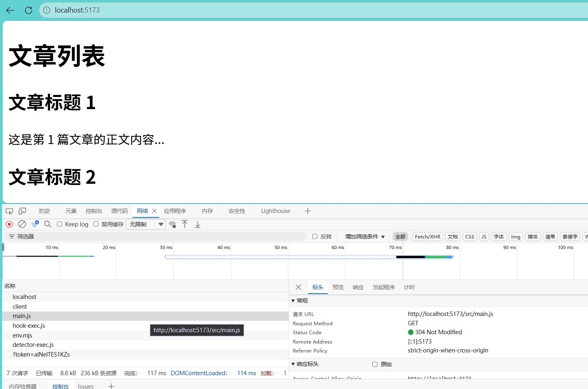
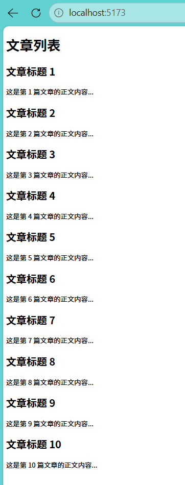
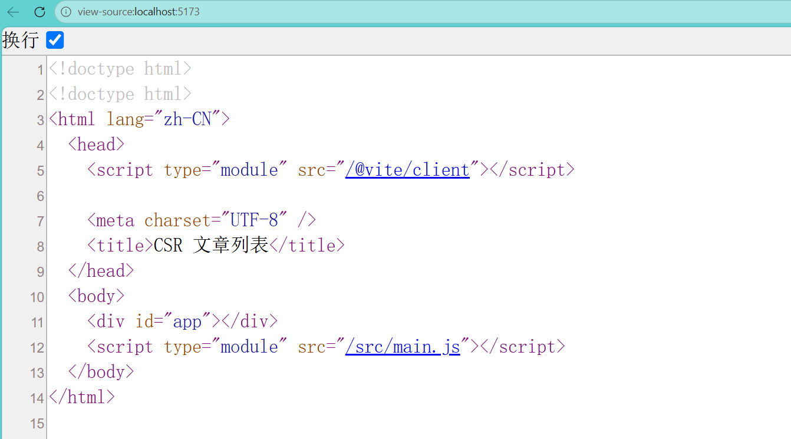

实验一：CSR / SSR / SSG 渲染对比
一、实验目的
直观理解三种渲染模式（CSR / SSR / SSG）的执行流程与本质区别，延伸认识 ISR 与混合渲染。

用客观指标：首屏 HTML 大小、FCP、LCP、SEO 可见性等量化三种模式的差异，让理论课结论有数据支撑。

建立渲染模式选型的工程判断力，用“内容变不变？要不要个性化？首屏多敏感？”三问做决策。

理解“五个时代”演进逻辑的一手实证：为什么 SPA 之后 SSR 会回来、SSG 为什么最稳等。

二、实验环境与工具
硬件：个人计算机，可联网

软件：Node.js v22.19.0、pnpm v12.9.1、Chrome（含 DevTools）、VS Code

技术栈：Vite 8 负责 CSR 脚手架与构建，Express 4 负责 SSR，Node 构建脚本负责 SSG

AI 工具：DeepSeek（辅助理解概念、排查报错），代码均亲自运行并截图

三、目录结构
text
se3306-exp1/
├── lab1-csr/ # Vite CSR 版（脚手架生成 + 自写 main.js）
├── lab1-ssr/ # Express SSR 版（server.js）
├── lab1-ssg/ # SSG 版（build-ssg.js + dist/）
├── images/ # 实验截图
├── README.md # 实验报告（本文件）
└── AI使用声明.md # AI 使用声明
四、实验内容与步骤
任务一：Vite 纯 CSR 应用

1. 创建项目
   bash
   pnpm create vite lab1-csr --template vanilla
   cd lab1-csr
   pnpm install
   pnpm run dev
   开发服务器默认运行在 http://localhost:5173。
2. 自检与截图
   pnpm run dev 后访问 http://localhost:5173，页面显示 10 篇文章。

右键 → 查看网页源代码，
 内为空，正文不可见。

DevTools Network 面板能看到 main.js 请求。

  

4. 适用场景及理由
   适用场景：后台管理系统、重交互 SPA。
   理由：CSR 首屏依赖 JS 下载与执行，SEO 不友好，但页面交互流畅、服务器压力小，适合登录后使用的内部系统。

任务二：Express 实现 SSR

1. 初始化项目
   bash
   mkdir lab1-ssr
   cd lab1-ssr
   pnpm init -y
   pnpm add express@4
   注意：若 package.json 中出现 "type": "module"，需删除，否则 require 会报错。

2. 编写 server.js
   javascript
   const express = require("express");
   const app = express();

const posts = Array.from({ length: 10 }, (\_, i) => ({
id: i + 1,
title: `文章标题 ${i + 1}`,
body: `这是第 ${i + 1} 篇文章的正文内容...`
}));

app.get("/", (req, res) => {
const now = new Date().toISOString(); // 时间戳证明每次请求都现拼 HTML

const html = `<!DOCTYPE html>

<html>
<head>
  <meta charset="UTF-8">
  <title>SSR 文章列表</title>
</head>
<body>
  <h1>文章列表</h1>
  
服务器生成时间：${now}

  ${posts
    .map(
      (p) => `<article>
        <h2>${p.title}</h2>
        
${p.body}

      </article>`
    )
    .join("")}
</body>
</html>`;

res.send(html);
});

app.listen(3000, () => {
console.log("SSR on http://localhost:3000");
}); 3. 运行并验证
bash
node server.js
访问 http://localhost:3000：

页面能看到 10 篇文章。

右键 → 查看网页源代码，正文直接在 HTML 中（SEO 友好）。

多次刷新，服务器生成时间 每次不同，证明 SSR 每次请求都现拼 HTML。

https://images/ssr-page.png
https://images/ssr-source.png
https://images/ssr-time-change.png

4. 适用场景及理由
   适用场景：电商详情页、个性化推荐、SEO 敏感页面。
   理由：SSR 首屏快、SEO 好，可结合用户信息动态渲染，但服务器每次请求都需计算，压力较大。

任务三：SSG 静态生成

1. 初始化项目
   bash
   mkdir lab1-ssg
   cd lab1-ssg
   pnpm init -y
2. 编写 build-ssg.js
   javascript
   const fs = require("fs");

const posts = Array.from({ length: 10 }, (\_, i) => ({
id: i + 1,
title: `文章标题 ${i + 1}`,
body: `这是第 ${i + 1} 篇文章的正文内容...`
}));

const html = `<!DOCTYPE html>

<html>
<head>
  <meta charset="UTF-8">
  <title>SSG 文章列表</title>
</head>
<body>
  <h1>文章列表</h1>
  ${posts
    .map(
      (p) => `<article>
        <h2>${p.title}</h2>
        
${p.body}

      </article>`
    )
    .join("")}
</body>
</html>`;

fs.mkdirSync("dist", { recursive: true });
fs.writeFileSync("dist/index.html", html);

console.log("静态页面已生成到 dist/"); 3. 生成并预览
bash
node build-ssg.js
python -m http.server 8080 -d dist
访问 http://localhost:8080：

dist/index.html 生成成功。

本地预览能访问，显示 10 篇文章。

查看源代码，正文写死在 HTML 里；不重新构建，内容永不改变。

https://images/ssg-page.png
https://images/ssg-source.png
https://images/ssg-dist.png

4. 适用场景及理由
   适用场景：博客、官方文档、营销落地页。
   理由：SSG 构建时生成静态 HTML，访问时零计算，首屏最快、最稳，适合内容不频繁更新的页面。

五、任务四：指标测量与对比
测量环境
浏览器：Chrome（Lighthouse Desktop 模式）

Node.js：v22.19.0

测量时间：2026-10-07

测量方式：Lighthouse Performance + 查看网页源代码字节数

测量数据
模式 首屏HTML大小 FCP LCP SEO源码含正文 适用场景
CSR 268 字节 0.9 s 1.0 s 否 后台管理系统、重交互 SPA
SSR 1004 字节 0.8 s 0.9 s 是 电商详情页、个性化推荐、SEO 敏感页面
SSG 962 字节 1.0 s 1.0 s 是 博客、官方文档、营销落地页
截图证据
https://images/csr-lighthouse.png
https://images/ssr-lighthouse.png
https://images/ssg-lighthouse.png

数据分析
HTML 大小：CSR 最小（268 字节），因为只有空壳和 JS 引用；SSR 最大（1004 字节），因为服务器每次拼接完整 HTML 返回；SSG 略小（962 字节），为构建时生成的纯静态文件。

FCP / LCP：本地环境下三者差异不大，Lighthouse 性能均为 100 分。SSR 的 FCP/LCP 略优（0.8s / 0.9s），符合服务端渲染首屏快的特性。真实网络环境下，CSR 因需下载并执行 JS，首屏会明显慢于 SSR/SSG。

SEO 可见性：CSR 源码中搜不到正文；SSR 和 SSG 源码直接包含正文，SEO 友好。

六、必答题
（1）为什么 SPA 时代 SEO 差？
SPA（CSR）首次返回的 HTML 是空壳，正文依赖浏览器下载并执行 JavaScript 后才动态渲染。搜索引擎爬虫虽然能执行部分 JS，但抓取效率低、等待时间长，且很多爬虫不执行 JS，导致页面内容无法被索引，因此 SEO 差。

（2）SSG 与 SSR 的本质区别是什么？
SSG：在构建时生成静态 HTML 文件，部署后每次访问直接返回该文件，服务器零计算。

SSR：在每次请求时由服务器实时拼接完整 HTML 返回，内容可动态变化。

本质区别在于生成 HTML 的时机：构建时 vs 请求时。

（3）结合讲次02渲染模式演进的理论，写一段200字左右的总结
从早期 SSR 到 SPA 盛行，再到 SSR/SSG/ISR 回归，渲染模式演进本质是围绕“内容变不变、要不要个性化、首屏多敏感”做权衡。SPA 交互好但 SEO 差、首屏慢；SSR 首屏快、SEO 好但服务器压力大；SSG 最快最稳但内容更新需重建；ISR 则兼顾静态速度与内容更新。Web Vitals 以 LCP、INP、CLS 衡量真实用户体验，成为评判渲染策略的标尺。没有银弹，选型需结合业务场景。

（4）前三个实验任务分别使用什么服务器？三种方式运行机制是怎样？
CSR：使用 Vite 开发服务器 / 静态文件服务器。服务器只返回空 HTML + JS，浏览器执行 JS 渲染页面。

SSR：使用 Express Node 服务器。每次请求到来时，服务器拼接完整 HTML 并返回。

SSG：使用静态文件服务器（如 serve、python -m http.server 或 CDN）。构建时生成 HTML，访问时直接返回文件。

（5）实时更新的股票行情页，三种模式加上 ISR，哪个最合适？为什么？
最合适：SSR + 客户端 WebSocket/轮询。
原因：股票行情需要实时更新，SSR 可保证首屏快速展示最新数据，之后客户端通过 WebSocket 或轮询持续更新。ISR 适合分钟级更新，不适合秒级实时；SSG 和纯 CSR 首屏实时性差。

（6）为什么 SSR 需要水合 Hydration？没有水合会怎样？
SSR 返回的是静态 HTML，虽然内容可见，但没有事件监听和交互能力。水合就是浏览器下载并执行 JS 后，将事件绑定到 DOM 上，让页面“活”起来。没有水合，页面只能看不能点，按钮、表单等交互全部失效。

七、选答题（任选一）
（7）什么条件下 SSG 是最优解？内容更新频繁时如何补救？
最优解条件：内容相对稳定、SEO 要求高、访问量大、无需个性化。
内容更新频繁的补救：使用 ISR（增量静态再生成），设置 revalidate 时间，过期后后台重新生成页面；或通过 Webhook 在内容更新时触发重新构建。这样兼顾静态速度与内容更新。

八、实验体会
通过本次实验，我亲手实现了 CSR、SSR、SSG 三种渲染模式，直观感受到它们的工作流程差异。CSR 的“空壳”原理让我明白了 SPA SEO 差的根本原因；SSR 的时间戳实验让我确信服务器每次请求都重新拼 HTML；SSG 的构建脚本让我看穿了 Jekyll/Hugo 等静态生成器的本质。测量数据也验证了理论：SSR/SSG 首屏更快、SEO 更好，而 CSR 交互流畅但首屏依赖 JS。今后在做项目选型时，我会用“内容变不变、要不要个性化、首屏多敏感”三问来决策，不再盲目跟风。

https://se3306csr-dp51w50bjn8o.edgeone.cool?eo_token=fdd7464e5efff5ddcb30fac99a7084b7&eo_time=1791377480
